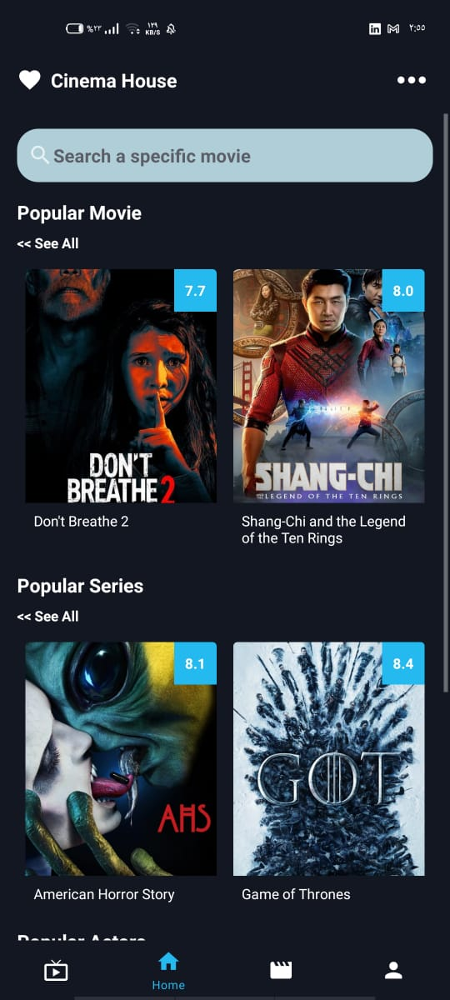
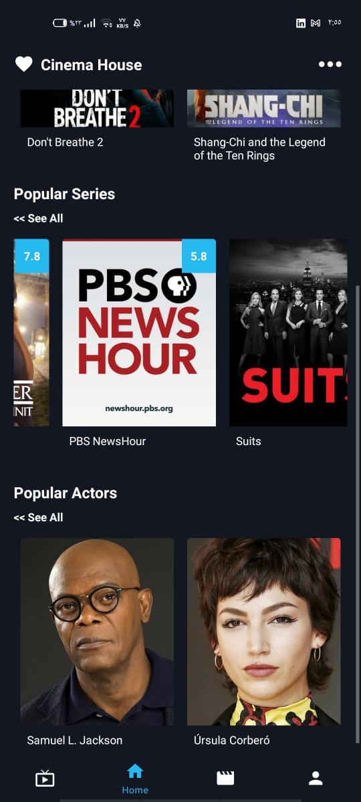
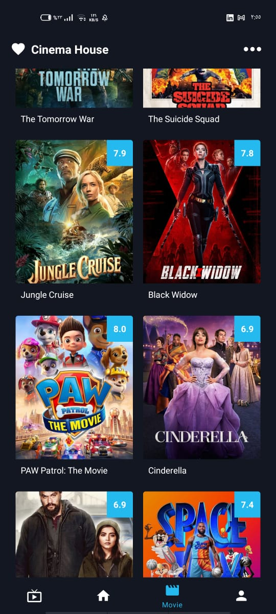
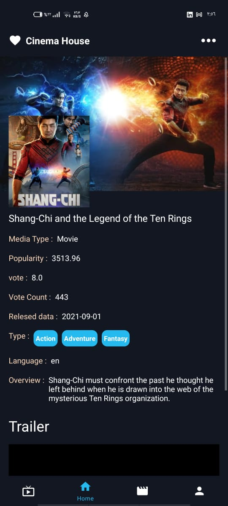
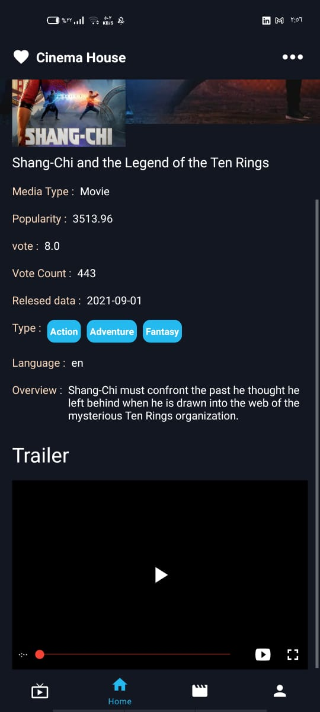
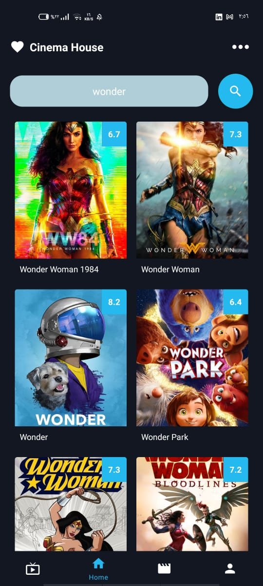

# cima-movie
## features
- Authentication (Log in ,Register)
- show movie
- search
- save in favorits
- log out

## Technology i used it
- room db
- retrofit 
- Navigation component
- Live Data
- Dependency injection (hilt degger)
- Coroutine
- databinding , viewbinding

 

## Log in 🌴🌴

 
 

## Register🌴🌴

 
 

 
 

 
 

 
 

 
 

 
 

 
 

 
 

